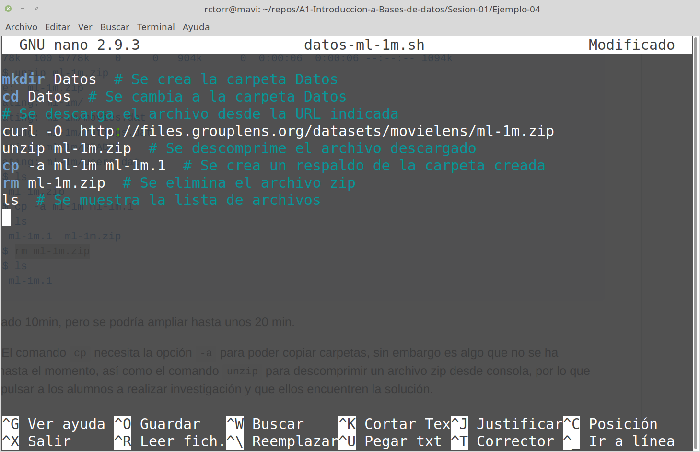

[`Fundamentos de Base de Datos`](../../Readme.md) > [`Sesión 01`](../Readme.md) > Proyecto
## Automatización de tareas con scripts

### OBJETIVOS
- Automatizar tareas con la creación de scripts
- Hacer uso de editores en la terminal
- Crear carpetas
- Descomprimir archivos
- Validar resultados

### REQUISITOS
1. Git Bash instalado para equipos con Windows
1. Carpeta de repositorio actualizada

### DESARROLLO
En el Reto-03 se preparó una carpeta de trabajo llamada `Datos` con todos los archivos y carpetas necesarios para seguir trabajando, pero a veces esta tarea se tiene que repetir varias ocasiones, así que ahora vamos a realizar los mismo que se realizó en el Reto-03, pero haciendo uso de scripts.

1. Abrir la terminal en Linux o MacOS y Git Bash en Windows

1. Haz que tu carpeta de trabajo sea `Introduccion-a-Bases-de-Datos/Sesion-01/Proyecto/`
   ```console
   $ cd Introduccion-a-Bases-de-Datos/Sesion-01/Proyecto
   Proyecto $
   ```

1. Se creará el archivo o script `datos-ml-1m.sh` usando el editor para terminal llamado `nano nombre-de-archivo`
   ```console
   Proyecto $ nano datos-ml-1m.sh
   ```
   Este comando abre el editor `nano` y ahora procedemos a agregar cada comando ejecutado en el Reto-03, un comando por línea, resultando algo similar a lo siguiente:
   

   Para __guardar__ el contenido recuerda presionar las teclas `Control+O` lo que mostrará el nombre del archivo a guardar y si no hay cambio alguno se presiona `Enter` y el archivo estará guardado.

   Para __salir__ del editor recuerda presionar las teclas `Control+X`.

1. Para ejecutar el script se hace uso del comando `bash nombre-de-script`
   ```console
   Proyecto $ bash datos-ml-1m.sh
     % Total    % Received % Xferd  Average Speed   Time    Time     Time  Current
                                    Dload  Upload   Total   Spent    Left  Speed
   100 5778k  100 5778k    0     0   134k      0  0:00:43  0:00:43 --:--:--  166k
   Archive:  ml-1m.zip
      creating: ml-1m/
     inflating: ml-1m/movies.dat        
     inflating: ml-1m/ratings.dat       
     inflating: ml-1m/README            
     inflating: ml-1m/users.dat         
   ml-1m  ml-1m.1
   Proyecto $
   ```
   El script debería de mostrar mensajes similares a los mostrados arriba sin aparecer mensajes de error, en todo caso para verificar que el script se ejecutó correctamente se debería de contar con una nueva carpeta `Datos` con la siguiente lista de carpetas y archivos:
   ```
   Datos/
   ├── ml-1m
   │   ├── movies.dat
   │   ├── ratings.dat
   │   ├── README
   │   └── users.dat
   └── ml-1m.1
       ├── movies.dat
       ├── ratings.dat
       ├── README
       └── users.dat
   ```

__Proyecto cumplido__
